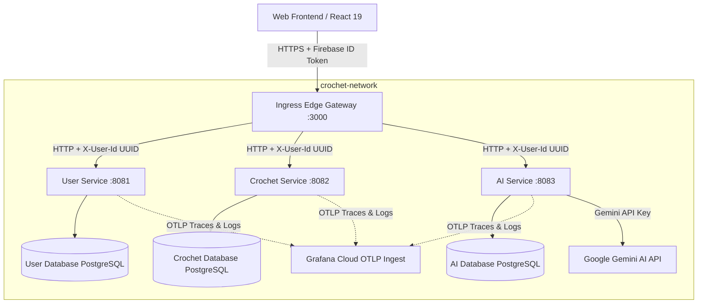

# 🧶 My Yarn Diary — AI-Powered Crochet Companion

An enterprise-grade, multi-service, AI-powered platform for crochet project tracking, pattern decoding, reverse engineering, and community galleries. Built with a modern microservices architecture, secure edge ingress, isolated datastores, and distributed tracing.

---

## System Architecture

The platform is designed as a distributed microservice system packaged in Docker containers and secured behind an Edge Ingress Gateway.



---

## Technology Stack

| Layer | Technologies & Frameworks |
|---|---|
| **Frontend UI** | React 19, TypeScript, Vite, Tailwind CSS v4, Motion (Framer Motion), Sentry React, Lucide Icons |
| **Edge Ingress Gateway** | Node.js, Express, TypeScript, Firebase Admin SDK |
| **Backend Services** | Java 21, Spring Boot, Spring Data JPA, Hibernate, Lombok |
| **Databases** | PostgreSQL 15 (Isolated instances for each service), Flyway (Schema Migration) |
| **AI Integration** | Google Gemini API (Multimodal Pattern Decoding & Reverse Engineering) |
| **Ops & Observability** | Docker Compose, OpenTelemetry (OTLP) Protobuf, Grafana Cloud |

---

## Security & Authentication Flow

1. **Perimeter Authentication**: The client logs in using Firebase Authentication and obtains a JWT ID Token.
2. **Token Verification**: Every request to `/api/v1/*` must pass through the Ingress Gateway, which verifies the JWT token's signature, expiration, and issuer using the Firebase Admin SDK.
3. **Identity Conversion**: The gateway hashes the alphanumeric Firebase user ID (`request.auth.uid`) into a stable RFC 4122 compliant UUID via MD5 hashing.
4. **Header Propagation**: The gateway strips the heavy authorization header to minimize network overhead and forwards requests downstream with clean HTTP identity headers:
   * `X-User-Id` (UUID)
   * `X-User-Email`
   * `X-User-Name`
   * `X-User-Avatar`
5. **Data Isolation**: Each Spring Boot service enforces relational database limits by matching the database's `userId` column against the injected `X-User-Id` header.

---

## Project Structure

```
├── backend
│   ├── ai-service          # Java/Spring Boot: Gemini Chat & Multimodal Pattern Decoding
│   ├── crochet-service     # Java/Spring Boot: Categories, Projects, Logs, and Gallery Management
│   ├── user-service        # Java/Spring Boot: Profile Syncing, Passwords & Memberships
│   └── gateway             # Node.js/TypeScript: Reverse Proxy & Firebase Token Verification
├── frontend                # Vite/React 19/TS Client App
├── docker-compose.yml      # Orchestrates all databases, gateway, and Java microservices
├── security_spec.md        # Technical Security Specification
└── README.md
```

---

## Getting Started & Local Setup

### Prerequisites
* **Docker** & **Docker Compose**
* **Node.js** (v18+) & **npm**

### Step 1: Configure Environment Variables
Copy `.env.example` to `.env` in the root directory:
```bash
cp .env.example .env
```
Fill in the required configurations:
* `FIREBASE_PROJECT_ID` (Your Firebase Console Project ID)
* `GEMINI_API_KEY` (Your Google Gemini AI API key)
* Custom PostgreSQL database credentials (if changing defaults)
* (Optional) `GRAFANA_OTLP_*` configuration fields for live distributed metrics/traces

### Step 2: Spin Up Backend Services
Run Docker Compose in the root directory to build and spin up the databases, services, and the edge gateway:
```bash
docker compose up --build -d
```
Verify the health status of all containers:
```bash
docker compose ps
```
The Ingress Gateway will be exposed on port `3000`. You can inspect the health check endpoint:
```bash
curl http://localhost:3000/health
```

### Step 3: Run the Frontend Application
Navigate to the frontend directory, install dependencies, and start the development server:
```bash
cd frontend
npm install
npm run dev
```
Open your browser at `http://localhost:5173`.

---

## Observability & Diagnostics

Each Java microservice is instrumented with the **OpenTelemetry (OTLP)** exporter. Traces, spans, and service telemetry logs are exported directly to Grafana Cloud via HTTP Protobuf protocol.

* **Distributed Tracing**: Follow user requests from the gateway through to the database.
* **Performance Analysis**: Identify bottlenecks in database queries or Gemini API calls.
* **Error Tracking**: Correlate frontend Sentry errors with backend microservice trace spans using propagated tracing context headers (`traceparent`, `baggage`).
