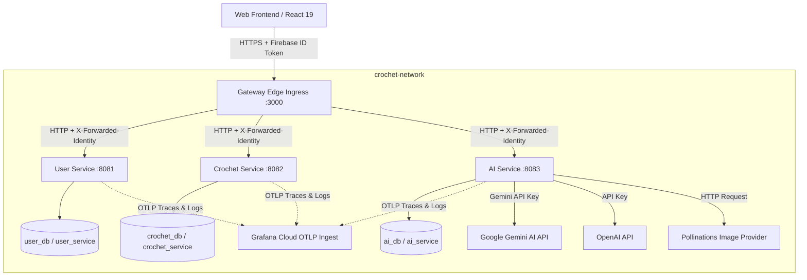

# My Yarn Diary - AI-Powered Crochet Companion

My Yarn Diary is an enterprise-grade, multi-service, AI-powered platform for crochet and fibre arts project tracking, journaling, AI assistance and lots more. Built with a modern Spring Boot microservices architecture, Spring Cloud Gateway edge ingress, and distributed OpenTelemetry tracing.

---

## System Architecture

The platform is designed as a distributed system packaged in Docker containers and secured behind a Gateway Edge Ingress router communicating over a private Docker network (`crochet-network`).



---

## Application Services & Features

The platform is partitioned into three core backend microservices:

### 1. User Service
The [User Service](file:///Users/shrutiprajapati/Documents/PROJECTS/PERSONAL%20PROJECTS/GITHUB%20PROJECTS/crochet-ai/backend/user-service) manages identity synchronization, accounts, and application-wide user configuration preferences:
* **Profile Synchronization**: Synchronizes user details (display name, email, profile picture) from Firebase gateway headers on user signup or sign-in.
* **Crochet Terminology Settings**: Allows users to configure and toggle their preferred crochet terminology (US versus UK terms) globally.
* **Account Management**: Supports account profile modifications and deletions, which execute soft deletions to preserve database consistency.
* **Password Management**: Handles user password updates securely via Firebase Admin integration, automatically revokes active refresh tokens across all devices, and logs event trails to the audit log.

### 2. Crochet Service
The [Crochet Service](file:///Users/shrutiprajapati/Documents/PROJECTS/PERSONAL%20PROJECTS/GITHUB%20PROJECTS/crochet-ai/backend/crochet-service) acts as the system database coordinator for crochet journaling, inventory, and tracking:
* **Directories & Categories**: Organizes projects into categories.
* **Project Tracker**: Tracks title, description, status (Planning, In Progress, Completed, On Hold), row count trackers, care instructions, total time, start/end dates, favorites status, and cover photos.
* **Yarn & Hook Inventory**: Tracks inventory details allocated per project:
  * *Yarn details*: brand, color, colorway, weight, yardage, dye lot, quantity, and notes.
  * *Hook details*: size in mm, letter size, material, brand, and notes.
* **Journal Logs**: Implements granular project tracking with date-stamped text logs, image attachments.
* **Pattern Document Manager**: Manages crochet pattern documents uploaded to individual projects.
* **Project Duplication**: Allows users to copy a project along with its categories, hooks, and yarns for repeating patterns. 
* **Project Gallery & Photo Management**: Allows users to upload project-specific photos, manage a project photo gallery.
### 3. AI Service
The [AI Service](file:///Users/shrutiprajapati/Documents/PROJECTS/PERSONAL%20PROJECTS/GITHUB%20PROJECTS/crochet-ai/backend/ai-service) integrates artificial intelligence and computer vision models into the crochet workflow:
* **Conversational AI Buddy**: A chat interface that operates with multiple underlying providers (Google Gemini API via GeminiProvider, OpenAI API via OpenAiProvider, or routing based on models via RoutingLlmProvider). Supports multimodal query contexts (attaching pattern images or project photos to chat messages).
* **Pattern Decoder**: Decodes crochet pattern documents or images using vision models, providing structure, difficulty level, stitches required, and row-by-row instructions.
* **AI Image Generator**: Generates visual designs, stitch inspiration, and crochet project layouts from text prompts using image generation models (such as Pollinations.ai, Gemini, or OpenAI).
* **AI Crochet Tutor**: Acts as an interactive tutor providing technique guides, step-by-step stitch instructions, and fiber arts advice.
* **Terminology Translation**: Dynamically translates crochet instructions between US and UK terminologies.
* **Daily Token Budgets**: Tracks prompt, completion, and reasoning tokens consumed per user, enforcing daily rate-limiting budgets to manage provider resource consumption.

---

## Technology Stack

| Layer | Technologies & Frameworks |
|---|---|
| **Frontend UI** | [React 19](file:///Users/shrutiprajapati/Documents/PROJECTS/PERSONAL%20PROJECTS/GITHUB%20PROJECTS/crochet-ai/frontend), TypeScript, Vite, Tailwind CSS v4, Motion (Framer Motion), Sentry React, Lucide Icons |
| **Edge Ingress Gateway** | [Gateway Service](file:///Users/shrutiprajapati/Documents/PROJECTS/PERSONAL%20PROJECTS/GITHUB%20PROJECTS/crochet-ai/backend/gateway) (Java 21, Spring Boot, Spring Cloud Gateway, Firebase Admin SDK, JJWT) |
| **Backend Services** | [User Service](file:///Users/shrutiprajapati/Documents/PROJECTS/PERSONAL%20PROJECTS/GITHUB%20PROJECTS/crochet-ai/backend/user-service), [Crochet Service](file:///Users/shrutiprajapati/Documents/PROJECTS/PERSONAL%20PROJECTS/GITHUB%20PROJECTS/crochet-ai/backend/crochet-service), [AI Service](file:///Users/shrutiprajapati/Documents/PROJECTS/PERSONAL%20PROJECTS/GITHUB%20PROJECTS/crochet-ai/backend/ai-service) (Java 21, Spring Boot, Spring Data JPA, Hibernate, Lombok) |
| **Databases** | PostgreSQL 15 (one server with isolated service databases, roles, and schemas), Flyway (Database Migrations) |
| **AI Integration** | Google Gemini API (AI assistant, Pattern Decoding), OpenAiProvider, PollinationsImageProvider |
| **Ops & Observability** | Docker Compose, OpenTelemetry (OTLP) Protobuf, Grafana Cloud, Sentry |

---

## Project Structure

```
├── backend
│   ├── ai-service          # Java/Spring Boot: Gemini Chat, OpenAI Chat, Image Generation & AI tools
│   ├── crochet-service     # Java/Spring Boot: Categories, Projects, Hooks, Yarns, Logs, and Photos
│   ├── user-service        # Java/Spring Boot: User Profile, Password Changes, Account Management
│   └── gateway             # Java/Spring Cloud Gateway: Reverse Proxy & Firebase Token Verification
├── frontend                # Vite/React 19 Client Web App
├── secrets                 # Local Firebase Admin service accounts config
├── docker-compose.yml      # Orchestrates PostgreSQL and Java microservices
├── docker/postgres         # PostgreSQL service database/schema initialization
├── security_spec.md        # Detailed Security Specification
└── README.md
```

---

## Getting Started & Local Setup

### Prerequisites
* **Docker** & **Docker Compose**
* **Node.js** (v18+) & **npm**

### Step 1: Configure Environment Variables
Copy `.env.example` to `.env` in the root directory:
```bash
cp .env.example .env
```
Fill in the required configurations:
* `FIREBASE_PROJECT_ID` (Your Firebase Console Project ID)
* `GEMINI_API_KEY` (Your Google Gemini AI API key)
* `DB_ENCRYPTION_SECRET` (A 256-bit Base64 encoded key for column encryption)
* `INTERNAL_JWT_SECRET` (A key for signing the internal gateway handoff JWT)
* `GRAFANA_OTLP_HEADERS` (Optional OTLP configuration fields for metrics and traces)

### Step 2: Spin Up Backend Services
Run Docker Compose in the root directory to build and spin up the databases, services, and the edge gateway:
```bash
docker compose up --build -d
```
Verify the health status of all containers:
```bash
docker compose ps
```
The Ingress Gateway will be exposed on port `3000`. You can inspect the health check endpoint:
```bash
curl http://localhost:3000/actuator/health
```

### Step 3: Run the Frontend Application
Navigate to the frontend directory, install dependencies, and start the development server:
```bash
cd frontend
npm install
npm run dev
```
Open your browser at `http://localhost:5173`.

---

## Observability & Diagnostics

Each Java microservice is instrumented with the **OpenTelemetry (OTLP)** exporter. Traces, spans, and service telemetry logs are exported directly to Grafana Cloud via the HTTP Protobuf protocol.

* **Distributed Tracing**: Follow user requests from the gateway through to the database.
* **Performance Analysis**: Identify bottlenecks in database queries or Gemini API calls.
* **Error Tracking**: Correlate frontend Sentry errors with backend microservice trace spans using propagated tracing context headers (`traceparent`, `baggage`).
