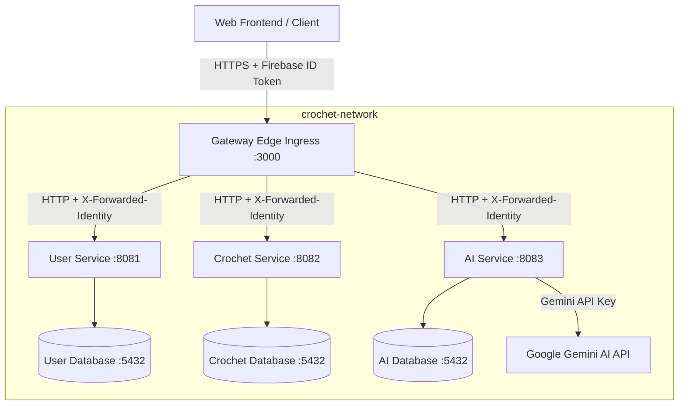

# Security Specification: MY YARN DIARY Multi-Service Architecture

This document specifies the security controls, authentication mechanisms, cryptographic protections, and data boundary controls implemented across the My Yarn Diary application architecture.

---

## 1. System & Network Architecture

The application is deployed using a containerized microservices architecture composed of a Gateway Ingress Edge router, downstream Java Spring Boot microservices, and dedicated isolated PostgreSQL databases. The services communicate over a private bridge network (`crochet-network`).

### 1.1 Port & Boundary Summary
* **Perimeter Gateway**: Exposed externally on port `3000`. Routes to downstream microservices based on request path mappings.
* **Internal Services**: Expose ports `8081` (user-service), `8082` (crochet-service), and `8083` (ai-service) internally. Downstream services do not bind public ports.
* **Database Isolation**: PostgreSQL databases bind only to internal container ports on `crochet-network` (and map to host ports `5432`, `5433`, and `5434` strictly on localhost for developer diagnostics). Direct external access is blocked.

---

## 2. Core Authentication & Identity Propagation

The system utilizes a secure, zero-trust token exchange and identity translation mechanism. The end-to-end request flow is processed in the following chronological sequence:

### Step 1: Client Authentication (Firebase Sign-In)
1. The user logs in on the React client application using the [AuthScreen](file:///Users/shrutiprajapati/Documents/PROJECTS/PERSONAL%20PROJECTS/GITHUB%20PROJECTS/crochet-ai/frontend/src/components/AuthScreen.tsx) component via Firebase Authentication (email/password or Google OAuth provider).
2. Firebase Authentication verifies the credentials and returns a cryptographically signed Firebase ID Token (JWT) to the client.

### Step 2: Frontend Request Preparation & Interception
1. The client-side Axios interface in [api.ts](file:///Users/shrutiprajapati/Documents/PROJECTS/PERSONAL%20PROJECTS/GITHUB%20PROJECTS/crochet-ai/frontend/src/lib/api.ts) interceptor proactively retrieves the Firebase ID Token using `getIdToken(false)`.
2. It appends the token to the HTTP request `Authorization` header as a Bearer token: `Authorization: Bearer <firebase_id_token>`.
3. If the request fails downstream with an HTTP `401 Unauthorized` status (due to token expiration), the response interceptor triggers silent recovery, forces a token refresh via `getIdToken(true)`, updates the Axios headers, and re-executes the original request.

### Step 3: Edge Gateway Ingress & Sanitization
1. The request arrives at the Gateway Edge Ingress router on port `3000`.
2. **Header Sanitization**: The [HeaderSanitizationFilter](file:///Users/shrutiprajapati/Documents/PROJECTS/PERSONAL%20PROJECTS/GITHUB%20PROJECTS/crochet-ai/backend/gateway/src/main/java/com/crochet/ai/gateway/filter/HeaderSanitizationFilter.java) running at `Ordered.HIGHEST_PRECEDENCE` inspects and deletes any client-supplied custom headers (`x-user-id`, `x-user-email`, `x-user-name`, `x-user-profile-picture`, `x-firebase-uid`, `x-forwarded-identity`) to prevent header spoofing.
3. **Perimeter Token Verification**: The [FirebaseAuthenticationFilter](file:///Users/shrutiprajapati/Documents/PROJECTS/PERSONAL%20PROJECTS/GITHUB%20PROJECTS/crochet-ai/backend/gateway/src/main/java/com/crochet/ai/gateway/filter/FirebaseAuthenticationFilter.java) extracts the Bearer token and verifies its authenticity asynchronously with the Firebase Admin SDK using `verifyIdTokenAsync(token)`. If validation fails, the request is rejected immediately with an HTTP `401 Unauthorized` response.

### Step 4: Gateway Identity Translation & Handoff Token Generation
1. **Deterministic UUID Mapping**: The gateway extracts the alphanumeric Firebase UID and maps it deterministically into an RFC 4122 compliant UUID structure. The [UuidGenerator](file:///Users/shrutiprajapati/Documents/PROJECTS/PERSONAL%20PROJECTS/GITHUB%20PROJECTS/crochet-ai/backend/gateway/src/main/java/com/crochet/ai/gateway/util/UuidGenerator.java) executes a Name-Based UUID generation using the SHA-256 hash bytes of the Firebase UID.
2. **Handoff Token Signing**: The [TokenProvider](file:///Users/shrutiprajapati/Documents/PROJECTS/PERSONAL%20PROJECTS/GITHUB%20PROJECTS/crochet-ai/backend/gateway/src/main/java/com/crochet/ai/gateway/util/TokenProvider.java) constructs a short-lived (60-second expiration) internal handoff JWT containing the translated `userId` (subject), `email`, `name`, `picture`, and `firebaseUid` claims. It signs this token using the HMAC-SHA256 key generated from `internal.jwt.secret`.
3. **Header Injection**: The gateway replaces the client's `Authorization` header with the newly generated `X-Forwarded-Identity` handoff token along with clean headers (`X-User-Id`, `X-User-Email`, `X-User-Name`, `X-User-Profile-Picture`, and `X-Firebase-Uid`) and proxies the request to the internal private container network.

### Step 5: Downstream Microservice Trust Verification
1. The request enters the target Spring Boot microservice (User, Crochet, or AI Service).
2. **Origin Enforcement**: The [GatewayTrustFilter](file:///Users/shrutiprajapati/Documents/PROJECTS/PERSONAL%20PROJECTS/GITHUB%20PROJECTS/crochet-ai/backend/crochet-service/src/main/java/com/crochet/ai/crochetservice/security/GatewayTrustFilter.java) at `@Order(1)` intercepts the request. It verifies the presence of the `X-Forwarded-Identity` header. If missing, it blocks execution and returns an HTTP `403 Forbidden` error.
3. **Signature Validation**: The filter cryptographically verifies the signature of the handoff token using `internal.jwt.secret` (ensured to be at least 256 bits by hashing the configuration value with SHA-256) and asserts that the token is not expired.
4. **Header Override Injection**: Upon validation, the filter wraps the request. When controller or security context layers query request headers (e.g., `x-user-id`, `x-user-email`), the request wrapper returns only the validated claims extracted from the JWT. This guarantees downstream services only consume cryptographically verified identity contexts.

---

## 3. Data Isolation & Logical Boundaries

* **Data Partitioning**: Database records are bound to the translated user UUID. Query results are restricted in the repository tier using custom queries (e.g., `findByUserId`), preventing blanket data leakage.
* **Ownership Checks**: In addition to querying records by owner ID, business actions verify resource ownership explicitly. For instance, creating a project checks that the parent category folder belongs to the requesting `X-User-Id`.
* **Cascade Constraints**: Cascade deletions are controlled. Deleting a parent category first checks permission, then deletes child entities programmatically, preventing orphans or cross-tenant contamination.

---

## 4. Cryptographic Database Column Encryption

Sensitive text fields are encrypted at the JPA model layer before persistence and decrypted automatically on retrieval.

* **Implementation**: Managed by [SecureTextAttributeConverter](file:///Users/shrutiprajapati/Documents/PROJECTS/PERSONAL%20PROJECTS/GITHUB%20PROJECTS/crochet-ai/backend/crochet-service/src/main/java/com/crochet/ai/crochetservice/util/SecureTextAttributeConverter.java) in the crochet service, and [ChatTextEncryptorConverter](file:///Users/shrutiprajapati/Documents/PROJECTS/PERSONAL%20PROJECTS/GITHUB%20PROJECTS/crochet-ai/backend/ai-service/src/main/java/com/crochet/ai/aiservice/util/ChatTextEncryptorConverter.java) in the AI service.
* **Algorithm**: **AES/GCM/NoPadding** (Advanced Encryption Standard in Galois/Counter Mode).
* **Initialization Vector (IV)**: A unique, cryptographically random 12-byte (96-bit) IV generated per write action using `SecureRandom`. The IV is prepended to the ciphertext.
* **Authentication Tag**: GCM generates a 128-bit authentication tag to guarantee ciphertext integrity.
* **Key Material**: Decoded from a Base64 string variable `DB_ENCRYPTION_SECRET`. Enforces a 256-bit (32 bytes) length requirement.
* **Encrypted Columns**:
  1. `Project.notes` (Stored in `crochet_db` as `encrypted_notes`)
  2. `JournalLog.textEntry` (Stored in `crochet_db` as `encrypted_text_entry`)
  3. `ChatMessage.textBody` (Stored in `ai_db` as `encrypted_text_body`)

---

## 5. Account & Password Management Security

Password changes are handled securely by the [UserService](file:///Users/shrutiprajapati/Documents/PROJECTS/PERSONAL%20PROJECTS/GITHUB%20PROJECTS/crochet-ai/backend/user-service/src/main/java/com/crochet/ai/userservice/service/UserService.java):
1. **Firebase Authentication Modification**: The password modification is processed using the Firebase Admin SDK.
2. **Device Refresh Token Revocation**: Revokes all active refresh tokens immediately on password change using `FirebaseAuth.getInstance().revokeRefreshTokens(firebaseUid)`, forcing immediate re-authentication across all devices.
3. **Audit Log Persistence**: Inserts an entry into the `audit_logs` table (`userId`, `action = "PASSWORD_CHANGE"`, `timestamp`).

---

## 6. AI Rate Limiting & Token Budget Controls

The AI Service protects downstream resources and LLM API budgets using database-backed rate-limiting controls in the [AiService](file:///Users/shrutiprajapati/Documents/PROJECTS/PERSONAL%20PROJECTS/GITHUB%20PROJECTS/crochet-ai/backend/ai-service/src/main/java/com/crochet/ai/aiservice/service/AiService.java):
* **Rate Limits Table**: Tracks quotas via the `user_rate_limits` table:
  * `userId`: Key mapping to user UUID
  * `dailyTokenBudget`: Number of daily tokens allowed (defaults to 50,000)
  * `tokensUsedToday`: Counter for tokens consumed
  * `lastRequestAt`: Instant of the last API request
* **Quota Reset**: Evaluates dates using UTC. If the current date is after `lastRequestAt`, `tokensUsedToday` is reset to zero.
* **Limit Enforcement**: Rejects incoming queries by throwing a `RateLimitExceededException` (returning HTTP 429) if the budget is exhausted.
* **Metric Tracking**: Stores prompt, completion, and reasoning tokens returned by the LLM response in the database.

---

## 7. The Threat Mitigation Matrix (The "Dirty Dozen")

| # | Threat / Attack Vector | Mitigation Level | Mechanism |
|---|------------------------|------------------|-----------|
| **1** | **User Profile Spoofing** Attacker attempts to update user profile records belonging to other users. | **Gateway & User Service** | The Ingress Gateway validates the Firebase ID token. The User Service checks that the `X-User-Id` header matches the path parameter `userId` using a case-insensitive check, rejecting modifications with a `ForbiddenException` (HTTP 403) on mismatch. |
| **2** | **Privilege Escalation** Attacker injects fields like `membershipStatus: PLATINUM_YARN` in request payloads. | **User Service** | The database entity roles are managed strictly via internal logic. Public endpoints ignore external property mapping for billing flags; upgrades require paid endpoints. |
| **3** | **Category Owner Spoofing** Attacker attempts to create category folders on behalf of another user. | **Crochet Service** | Endpoints extract the `X-User-Id` header (injected by the Gateway after cryptographic verification) and bind it directly to the database category record, ignoring request-body user fields. |
| **4** | **Category Name Ballooning (DoS)** Attacker attempts to overload the database with extreme name sizes. | **Crochet Service & DB** | Spring Validation checks request formats (`@NotBlank`, `@Size`), rejecting inputs that violate model definitions prior to JPA parsing. |
| **5** | **Project Cross-User Hijacking** Attacker links their project to a victim's folder ID. | **Crochet Service** | When creating or modifying a project, the service checks that the parent category (`categoryId`) exists and is owned by the requesting `X-User-Id`. |
| **6** | **Unauthenticated Requests** Attacker attempts to issue requests bypassing Firebase login. | **Gateway Edge Ingress** | The `FirebaseAuthenticationFilter` rejects any requests that do not contain a valid Bearer JWT, returning HTTP `401 Unauthorized` before forwarding downstream. |
| **7** | **Immutable Field Tampering** Attacker attempts to override transaction dates (`createdAt`) or system keys. | **Microservices** | Entity creation and modification times are assigned server-side using system dates or database trigger defaults, ignoring client request inputs. |
| **8** | **Numeric Bounds Poisoning** Attacker attempts to post negative counts (e.g. `rowCount: -50`). | **Crochet Service** | Validation constraints (`@Min(0)`, `@PositiveOrZero`) reject invalid values at the controller boundary, returning HTTP `400 Bad Request`. |
| **9** | **Orphan Journal Log Injection** Attacker attempts to post logs referencing a victim's project ID. | **Crochet Service** | Before inserting a journal log, the service fetches the referenced project and verifies its owner matches the active user's `X-User-Id`. |
| **10** | **Structural Payload Spoofing** Attacker posts JSON payloads containing database columns or system details. | **Jackson / Controller Tier** | Controller endpoints map payloads to strict DTO classes (e.g. `ProjectRequest`, `YarnRequest`), discarding unmapped properties automatically. |
| **11** | **Chat Session Hijacking** Attacker attempts to fetch or delete chat sessions of other users. | **AI Service** | Session operations query database records filtered strictly by user UUID. Deletes confirm ownership before dropping chat entities. |
| **12** | **Blanket Database Scraping** Attacker requests all records (e.g. `/projects` or `/chats`). | **Database Queries** | JPA repositories execute filtered queries (e.g., `findByUserId`) rather than exposing open select commands. |
