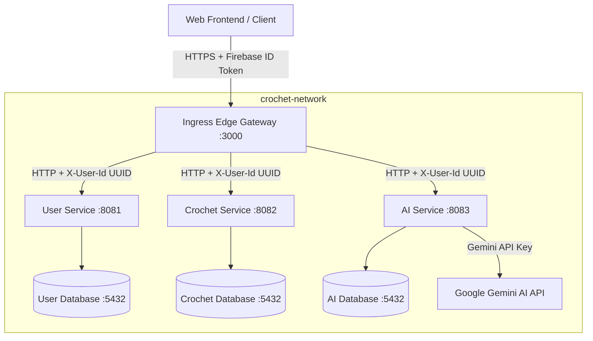

# Security Specification: crochet.ai Multi-Service Architecture

This document specifies the security controls, authentication mechanisms, and data boundary protections implemented in the `crochet.ai` application architecture.

---

## 1. System & Network Architecture

The application is deployed using a containerized microservices architecture composed of a secure ingress edge gateway, downstream Java Spring Boot microservices, and dedicated isolated PostgreSQL databases, communicating over a private Docker bridge network (`crochet-network`).



---

## 2. Security Controls & Mechanisms

### 2.1 Perimeter Security (API Gateway)
* **Authentication Provider**: Firebase Authentication.
* **Token Verification**: The Edge Gateway interceptor validates incoming Bearer JWT tokens in the `Authorization` header using the Firebase Admin SDK (`getAuth().verifyIdToken(token)`).
* **Token Stripping**: To prevent downstream processing overhead and token leakage, the gateway strips the `Authorization` header after authentication and converts the identity context.
* **Identity Translation**: Firebase provides variable-length alphanumeric UIDs (e.g., `google-oauth2|12345`). To ensure downstream Java services can leverage high-performance `UUID` types, the gateway translates the Firebase UID into a stable RFC 4122 compliant UUID via MD5 hashing:
  ```typescript
  function getUuidFromFirebaseUid(uid: string): string {
    const hash = crypto.createHash('md5').update(uid).digest('hex');
    return `${hash.substring(0, 8)}-${hash.substring(8, 12)}-3${hash.substring(13, 16)}-8${hash.substring(17, 20)}-${hash.substring(20, 32)}`;
  }
  ```
* **Identity Propagation**: The gateway propagates the authenticated identity downstream via custom headers:
  * `X-User-Id` (MD5-converted UUID string)
  * `X-User-Email`
  * `X-User-Name`
  * `X-User-Avatar`

### 2.2 Service-Level Access Controls (Java Spring Boot Services)
* **Authentication Boundary**: Downstream services (`user-service`, `crochet-service`, `ai-service`) rely on the gateway for token validation and receive the user identity via the `X-User-Id` header.
* **Logical Isolation**: Every business transaction validates resource ownership by asserting that the owner ID matching the database record equals the incoming `X-User-Id` header.
* **Cascade Constraints**: Deletions are securely cascaded. For example, deleting a category verifies owner permission first, then removes child projects and associated journal logs.

### 2.3 Data Layer Security (PostgreSQL & Flyway)
* **Isolated Datastores**: Three separate PostgreSQL 15 databases (`user-db`, `crochet-db`, `ai-db`) are deployed in isolated containers.
* **Network Restrictions**: Database containers are only accessible within the internal `crochet-network` and bind to localhost ports only for local development purposes.
* **Schema Versioning**: Migrations are strictly version-controlled and applied programmatically on service startup using Flyway.

---

## 3. The Threat Mitigation Matrix (The "Dirty Dozen")

The system mitigates the 12 classic security threats against identity, integrity, and resource boundaries as follows:

| # | Threat / Attack Vector | Mitigation Level | Mechanism |
|---|------------------------|------------------|-----------|
| **1** | **User Profile Spoofing**<br>Attacker requests target profile updates. | **Gateway & User Service** | The Edge Gateway enforces that the profile token is verified. The User Service reads `X-User-Id` directly from secure gateway-injected headers, ensuring users can only modify their own profile data. |
| **2** | **Privilege Escalation**<br>Attacker injects fields like `role: "admin"` in signups. | **User Service** | The database entity has no `role` or `isAdmin` mutable parameters exposed in public DTOs. Users are synced automatically as `FREE` members; upgrades require explicit payment/membership requests. |
| **3** | **Category Owner Spoofing**<br>Attacker creates directories for another user. | **Crochet Service** | The endpoint ignores any user ID fields in the request body and enforces mapping to the authenticated `X-User-Id` parsed from the request header. |
| **4** | **Category Name Ballooning (DoS)**<br>Attacker posts extreme string sizes. | **Crochet Service & DB** | The database column definitions restrict names, and API input validation restricts field sizes (e.g. up to 100 characters for category names). |
| **5** | **Project Cross-User Hijacking**<br>Attacker links their project to a victim's folder. | **Crochet Service** | When creating or updating a project, the service checks that the parent category (`folderId`) exists and is owned by the requesting `X-User-Id`. |
| **6** | **Unauthenticated Requests**<br>Attacker issues requests without a JWT token. | **Edge Gateway** | The `authenticate` gateway middleware rejects all requests missing a valid Bearer token with an HTTP `401 Unauthorized` response before reaching downstream endpoints. |
| **7** | **Immutable Field Tampering**<br>Attacker attempts to alter `createdAt` or `userId`. | **Microservices** | Entity creation dates are assigned on the server side using the system clock or database defaults. Re-binding request updates to the database ignores immutable fields. |
| **8** | **Numeric Bounds Poisoning**<br>Attacker posts negative counts (`rowCount: -50`). | **Crochet Service** | Service-level business validation rejects negative numbers or bad formats, returning `400 Bad Request`. |
| **9** | **Orphan Journal Log Injection**<br>Attacker posts logs referencing a foreign project ID. | **Crochet Service** | Before inserting a journal log, the service fetches the referenced project and verifies its owner matches the active user's `X-User-Id`. |
| **10** | **Structural Payload Spoofing**<br>Attacker posts fields not defined in the schema. | **Jackson / JSON Parser** | Strict JSON parsing at the controller level rejects unrecognized parameters and drops unmapped properties. |
| **11** | **Chat Session Hijacking**<br>Attacker renames/reads chat sessions of another user. | **AI Service** | Session fetch and update queries strictly filter by `userId` and verify ownership of the target session. |
| **12** | **Blanket Database Scraping**<br>Attacker requests all records (`/projects` or `/chats`). | **Database Queries** | Repositories implement custom finder methods (e.g., `findByUserId`) rather than exposing blanket list commands. |
